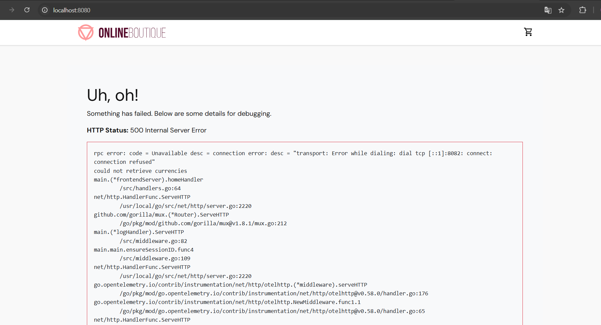
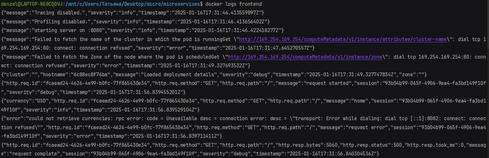
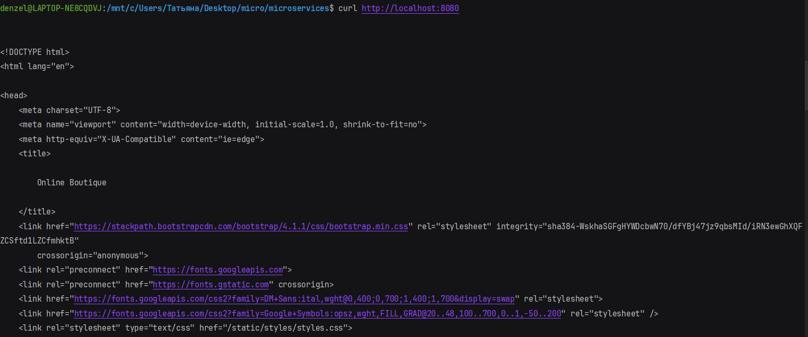
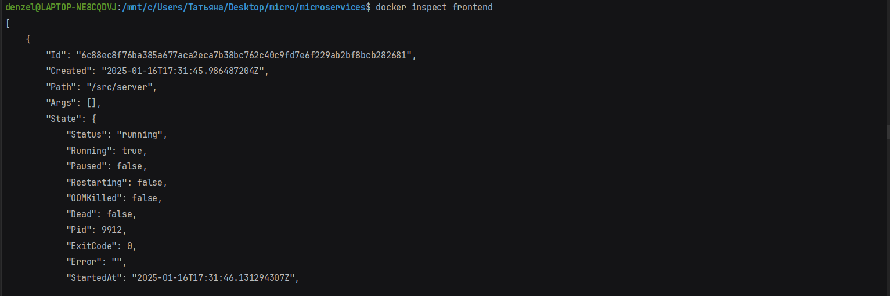
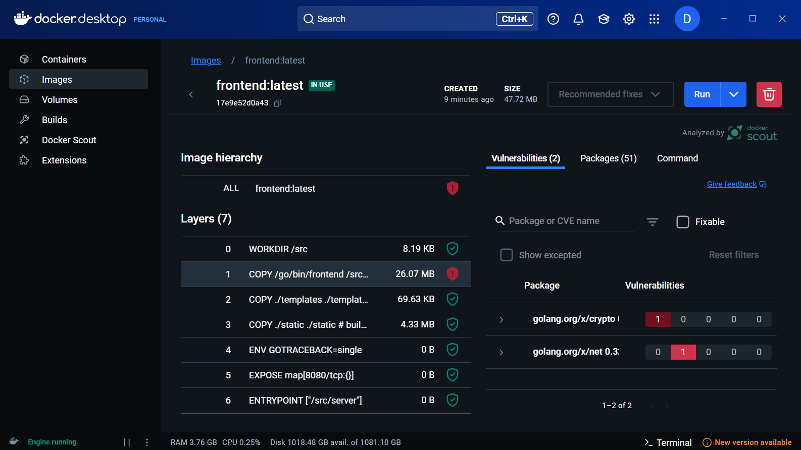
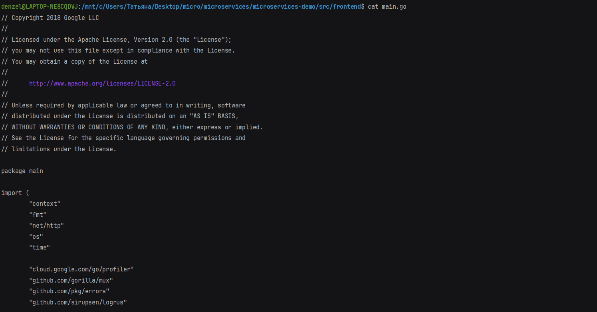

# Задание

1. Выбрать один из микросервисов https://github.com/GoogleCloudPlatform/microservices-demo
   развернуть через докер.

2. Сколькими способами можно посмотреть содержимое конкретного файла?

# Решение

## 1. Развертывание через Docker

- Возьмём в качестве примера сервис frontend. Для развертывания выполним следующие шаги:

1. Клонирование репозитория:
```bash
    git clone https://github.com/GoogleCloudPlatform/microservices-demo.git
    cd microservices-demo/src/frontend
```

2. Сборка Docker-образа:
```bash
    docker build -t frontend .
```
3. Запуск контейнера:
```bash
    docker run -d --name frontend -p 8080:8080 frontend
```
- Теперь сервис доступен на локальной машине по адресу http://localhost:8080.
- Но к сожалению, микросервис frontend в данном проекте зависит от других микросервисов, таких как currencyservice, productcatalogservice, cartservice, recommendationservice и других. 
Эти сервисы должны быть запущены, чтобы frontend мог корректно функционировать, поскольку они предоставляют данные, которые нужны для отображения информации на фронтенде.
Каждый микросервис в этом проекте выполняет отдельную роль, и они взаимодействуют друг с другом по сети через RPC (remote procedure calls). Когда один из сервисов не запущен, frontend не может подключиться к нему.


## 2. Cпособы чтобы посмотреть содержимое конкретного файла:

- Через лог-файлы контейнера: Используйте команду Docker для просмотра логов запущенного контейнера:

- Через взаимодействие с API:

- Через просмотр метаданных контейнера:

- С использованием Docker desktop:

- Через исходный код:

